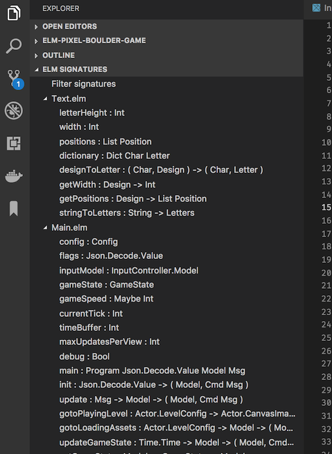
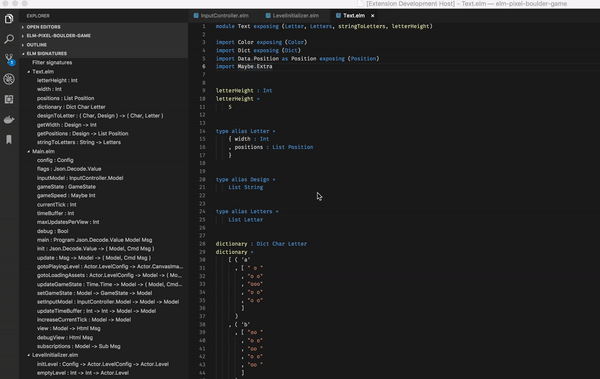

# vscode-elm-signature : Adds hoogle like functionality to your Elm projects

`vscode-elm-signature` provides [hoogle](https://www.haskell.org/hoogle/) like functionality to your Elm projects. **You can use it to search your codebase to search by function name, or type signature**.

## Features

### Signatures overview

`vscode-elm-signature` keeps an up to date list of all of your Elm function signatures.

### Filtering

`vscode-elm-signature` lets you filter signatures per function name, or type signature

Filtering can be done by clicking on the `filter signatures` item in the Tree view.

`Note: To reset the filter, simply perform another search with an empty filter value`

## Known Issues

Calling out known issues can help limit users opening duplicate issues against your extension.

You can find a complete list of issues [here](https://github.com/jlengrand/vscode-elm-signature/issues).

However, in short : 

* This extension is a first proof of concept and should **NOT** be considered ready for an exensive usage!
* The implementation of the extension is currently very naive and requires much more processing than needed. It might also mean that the extension can hang on large projects
* The current Elm parser is done using a `regex`, which means:
    * Functions without signatures will not be detected
    * Spaces in function signatures have to be respected to work properly. Respect [elm-format](https://github.com/avh4/elm-format) conventions for good measure.
* The UI is most likely to change in the future

## Release Notes

This extension is not officially released yet.

## Contributing and copyright

The project is hosted on [GitHub](https://github.com/jlengrand/vscode-elm-signature) where you can [report issues](https://github.com/jlengrand/vscode-elm-signature/issues), fork
the project and submit pull requests.

The library is available under [MIT license](https://github.com/jlengrand/vscode-elm-signature/blob/master/LICENSE), which allows modification and redistribution for both commercial and non-commercial purposes.

## Maintainer(s)

* Julien Lengrand-Lambert [@jlengrand](https://github.com/jlengrand)

Help is more than welcome!